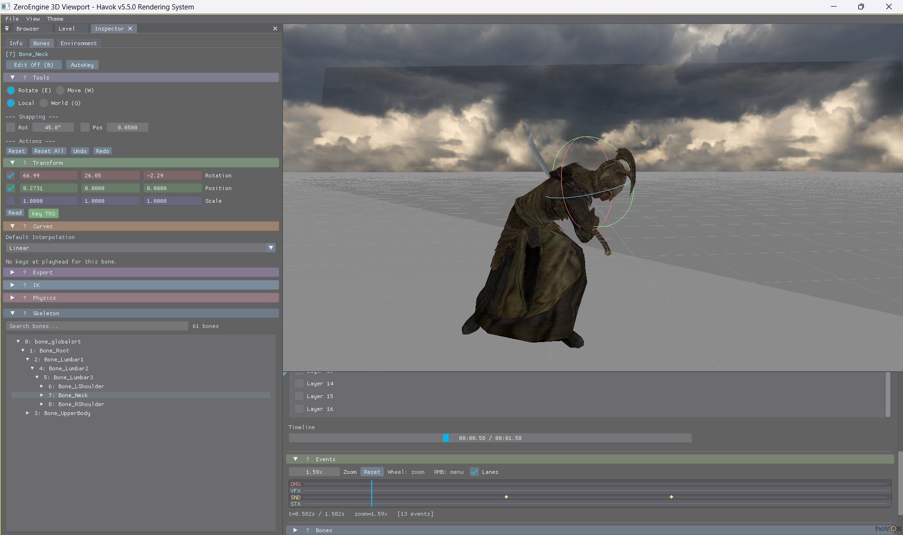

# Vespucci Engine — LOTR: Conquest Reverse Engineering Toolkit

A reverse-engineered, engine-level tooling suite for **The Lord of the Rings: Conquest** (Pandemic Studios, 2009). Built over 7 years of binary analysis, Ghidra sessions, and mass amounts of caffeine.

This toolkit enables structured inspection, editing, and debugging of every game system — 3D scene rendering, full level loading, animation pipelines, skeletal editing, collision building, particle effects, audio debugging, crash diagnostics, and a biologically accurate neural network visualization platform that has absolutely no business being here but exists anyway.

Pandemic Studios called their engine **"Magellan"** internally. We call ours **Vespucci** — because Vespucci mapped what Magellan discovered.

> **See [Important.md](Important.md) for setup instructions, known issues, and the `ConquestLLC.exe` requirement.**

---

## Screenshots

### Level Viewer


### Model Viewer


### Animation


### Event Graph


### Galaxy View


### Neural View


### Cosmic Graph


### Flow Graph


### Explorer Graph


### Lua Scripts Graph


### Events on Map


### Collision Wireframes
.png)

---

## Quick Start

1. You need a retail copy of **The Lord of the Rings: Conquest**
2. Get the patched **`ConquestLLC.exe`** from the [Discord](https://discord.gg/rEh5Tfz6JD) — the original exe will NOT load mods
3. Extract `dev.rar` into your game executable directory
4. **Disable Windows Defender** — it flags the injector and proxy DLLs as false positives (they are not malware)
5. Launch `Conquest3DViewport.exe` from the `Scene3D` folder
6. It auto-scans `../GameFiles/` for models, animations, textures, and effects
7. **Do NOT resize the window after the program finishes initializing** — resizing causes a crash. Force fullscreen while the program is still loading.

### Required DLLs (must be next to the EXE)

| DLL | Purpose |
|---|---|
| `imgui_d3d9.dll` | ImGui docking UI (compiled separately with VS2022) |
| `cg.dll` / `cgGL.dll` | Cg shader runtime (from Havok SDK) |
| `dppDx.dll` | DirectX processing (from Havok SDK) |
| `d3dx9_29.dll` | DirectX 9 helper functions |

### Navigation Modes

The 3D viewport supports 3 camera control styles (switchable in Settings):

| Mode | Orbit | Pan | Zoom |
|---|---|---|---|
| **Maya** (default) | Alt+LMB | Alt+MMB | Alt+RMB / Wheel |
| **Blender** | MMB | Shift+MMB | Wheel |
| **Unreal** | RMB | MMB | Wheel |

---

## Features

### 3D Scene Viewer

- Real-time **Direct3D9 renderer** loading native Conquest engine data
- Meshes, skeletal rigs, animation channels, materials, particles, skyboxes
- **Orbit/pan/zoom camera** + first-person fly-through mode for level exploration
- **Bone editor** with rotation/translation gizmos, undo/redo, pose library, keyframe recording
- Animation playback with **multi-layer blending**, **Lua-scripted animation graphs**, and **motion matching**
- **Particle system preview** using Pandemic's actual compiled D3D9 shaders from the retail disc
- **Material inspector** with DDS texture preview, gamma control, anisotropic filtering, mip bias
- **Asset browser** for batch loading 50,000+ game assets with search and filtering
- Full **ImGui docking UI** via `imgui_d3d9.dll` — every panel is dockable, resizable, and tabbed

### Level Editor

- Load **entire Conquest levels** directly from PAK/BIN files — thousands of mesh instances at 60fps
- **Level Inspector** — click any object to see its type, fields, transforms, events, game mode mask
- **Event Graph** — visual node editor for Pandemic's entity event system with 4 zoom scales:
  - **Constellation** — layer clusters as star systems
  - **Galaxy** — entities as orbiting planets around folder-stars
  - **Neural** — event connections as a biologically-modeled neural network with Hodgkin-Huxley dynamics
  - **Cosmic** — individual entity relationships with supernova transitions
- **Entity creation** wizard with full type definition support
- **Object positioning** with 3D translate/rotate gizmos
- **Collision mesh building** — generate meshes from model geometry, build MOPP BVTrees via Havok 5.5
- **Save modified levels** through Rust parser pipeline (automatic dump + recompile sanitization)
- **Game mode filtering** — view which entities belong to which game modes (Campaign, Conquest, Hero modes)

### Animation System (Still Experimental)

- **11,726 animations** decoded from 6 different compression schemes (ThreeComp40, ThreeComp48, ThreeComp24, Polar32, Straight16, Uncompressed)
- **Lua animation state machine** — rebuilt Pandemic's scripted animation system: states, transitions, conditions, blend trees, parametric blending
- **AnimTable & filter evaluation** — stance/action filtering for clip resolution
- **Motion matching** — data-driven animation selection based on velocity and facing direction
- **Root motion** — full/clampY/off/extract modes with axis locking and warp targeting
- **IK system** — FABRIK solver with foot placement, look-at, aim-at, and custom chain support
- **Physical animation / ragdoll** — spring-damper bone simulation with impulse response
- **Timeline editor** — keyframe editing with 29 easing types, custom Bezier curves, animation events (sound, damage, particle, camera, state, projectile, throw, bow, controller, grab, charge)
- **Compression tools** — analyze and optimize keyframe data with configurable tolerances
- **Export** — save custom animations as JSON clips

### Mocap from Webcam (Experimental DOES NOT WORK PROPERLY)

- **WHAM-based motion capture** — spawns Python subprocess running real-time pose estimation
- **24 SMPL joints → 62 game bones** retargeting with coordinate system conversion
- **Savitzky-Golay smoothing** and procedural finger curl
- **Export to native Conquest animation format** (ThreeComp40 packed quaternions)
- ImGui control panel with webcam preview, recording controls, bone map visualization

### Neural Network Visualizer

- **Biologically accurate** 3D neural rendering — not circles-and-lines, actual neuroscience
- **Membrane wobble** from voltage-dependent displacement (Zhang et al., 2001)
- **Voltage-to-color** ramp matching calcium imaging conventions (-70mV → +40mV)
- **Hebbian plasticity glow** representing Long-Term Potentiation (Hebb, 1949)
- **Subsurface scattering** approximation for translucent neural tissue
- **6 render passes**: geometry → depth → SSAO → bloom → blur → fog composite
- **Fresnel rim** glow from membrane refractive index mismatch (n≈1.46 vs n≈1.33)
- Runs on a **separate OpenGL 3.3 thread** alongside the D3D9 game renderer
- Full scientific breakdown with citations in `neural_gl_renderer.h`

### Crash Preventer

Drop-in stability layer for the original game:

| File | Role |
|---|---|
| `version.dll` | Auto-loads debugger at game launch |
| `ConquestDebugger.dll` | Crash handler, minidump writer, memory/thread monitor |
| `d3d9.dll` (16 KB) | Lightweight D3D9 proxy for render-path stability |

Copy all three into the game's root directory. No configuration needed.

### Audio Debugger

Runtime audio inspection overlay:

| File | Role |
|---|---|
| `d3d9.dll` (50 KB) | D3D9 proxy with debug hooks |
| `DebugOverlay.dll` | In-game BNK browser, audio event viewer, custom playback |
| `Injector.exe` | Injects overlay into running game process |

Launch the game first, then run `Injector.exe`.

---

## Architecture

```
ZeroEngine/
├── Scene3D/              # Main engine — 69 source files, ~50,000 lines
│   ├── RE/               # 35 reverse-engineered Magellan engine headers (Mg*)
│   ├── imgui/            # Dear ImGui (docking branch)
│   └── collision_repack.py
├── Engine/
│   ├── DLL/              # Runtime DLLs (D3D9 proxy, debugger, audio overlay)
│   │   ├── ConquestDebugger/
│   │   ├── D3D9Proxy/
│   │   └── ConquestConsole-main/
│   ├── source/           # Havok 5.5.0 SDK (not redistributed)
│   └── lib/              # DirectX SDK (not redistributed)
├── CoreScripts/          # lotrc Rust parser (haighcam, MIT license)
├── GameFiles/            # Extracted game assets (not redistributed)
└── tools/                # lotrc_rs.exe, build scripts
```

### Split Compiler Architecture

| Component | Compiler | Standard | Why |
|---|---|---|---|
| Main engine + Havok | VS2005 | C++03 | Havok 5.5 .lib files require VS2005 ABI |
| ImGui DLL | VS2022 | C++17 | ImGui needs modern C++ |
| Communication | Pure C ABI | `extern "C"` | Only safe way to cross compiler versions |

---

## Save Pipeline

### Level Save (Save PAK)

1. C++ `SavePak()` writes modified PAK
2. `lotrc_rs.exe -d` dumps to editable format (sanitize pass)
3. `lotrc_rs.exe -c` recompiles from scratch
4. Clean PAK/BIN copied back

### Collision Save (Save to PAK in Model Viewer)

1. Collision mesh + MOPP exported to `collision_export.json`
2. `collision_repack.py` subprocess: dump PAK → patch model shapes → recompile
3. Or manually: `python collision_repack.py "<pak>" "collision_export.json" "<model_name>" "<lotrc_rs_path>"`

Both pipelines require `lotrc_rs.exe`. Collision also requires Python 3.x.

---

## Building from Source

> **You do NOT need to build from source to use the toolkit.** Pre-built binaries are available in [Releases](../../releases). This section is only for developers who want to compile the engine themselves.

### Required SDKs (not redistributable)

The following SDKs are **required to compile** but cannot be legally redistributed. They are no longer available from their original sources — join the **[Discord](https://discord.gg/rEh5Tfz6JD)** to get setup guidance and access to these files:

| Dependency | Notes |
|---|---|
| **Havok 5.5.0 SDK** | Physics + animation + graphics bridge. Microsoft acquired Havok and buried all old versions. Available on Discord. |
| **DirectX SDK (March 2008)** | D3D9 headers and libs. Microsoft no longer hosts the 2008 version. Available on Discord. |
| **Wwise SDK** | Audio middleware headers. Free tier exists from Audiokinetic but the specific version we need is old. Available on Discord. |
| **Visual Studio 2005** | Required for main engine compilation (Havok ABI). Microsoft no longer distributes VS2005. Available on Discord. |
| **Visual Studio 2022** | Required for ImGui DLL (`imgui_d3d9.dll`). Free Community Edition from Microsoft. |
| **Python 3.x** | Required for collision pipeline and mocap. Free from python.org. |
| **lotrc_rs.exe** | Rust PAK/BIN parser. Available on Discord and Haighcam's repository. |

> **Why Discord?** These are 2008-era proprietary SDKs that no longer exist on official download servers. Distributing them on GitHub would violate their licenses. The Discord server provides them for preservation and modding research purposes only.

---

## Controls

### Camera

| Input | Action |
|---|---|
| **Alt + Left Mouse** | Orbit around target |
| **Alt + Middle Mouse** | Pan camera |
| **Alt + Right Mouse** | Dolly (zoom via drag) |
| **Mouse Wheel** | Zoom in/out |
| **F** | Focus camera on model |
| **F3** | Toggle fly camera (WASD + mouse look) |

### Fly Camera (F3)

| Input | Action |
|---|---|
| **WASD** | Move forward/back/strafe |
| **Space** | Jump (gravity on) / Ascend (gravity off) |
| **C** | Ascend |
| **G** | Toggle gravity on/off |
| **Right Mouse + Drag** | Look around |

### General

| Key | Action |
|---|---|
| **F1** | Toggle help overlay |
| **H** | Toggle info overlay (model, anim, settings) |
| **F2** | Toggle Asset Browser |
| **F4** | Toggle skybox / editor objects (level mode) |
| **F5** / **Ctrl+R** | Rescan GameFiles |
| **F6** | Toggle Asset Data Inspector |
| **Shift+F6** | Cycle skybox |
| **F9** | Toggle Legacy Win32 UI |
| **F10** | Cycle sky render mode |
| **F11** | Toggle dark/light theme |
| **Esc** | Cancel edit / close browser / quit |

### Animation Playback

| Key | Action |
|---|---|
| **Space** / **Insert** | Play / Pause |
| **F7** / **Page Up** | Previous animation |
| **F8** / **Page Down** | Next animation |
| **Z** / **Home** | Seek to start |
| **X** / **End** | Seek to end |
| **[** / **8** | Step back 0.25s |
| **]** / **9** | Step forward 0.25s |
| **Arrow Up/Down** | Blend walk/run (blend mode) |

### Asset Browser (F2)

| Key | Action |
|---|---|
| **Tab** | Switch Model / Animation mode |
| **Up/Down** | Navigate list |
| **Enter** | Load selection |
| **Esc** | Close browser |

### Bone Editor (B to activate)

| Key | Action |
|---|---|
| **B** | Toggle edit mode on/off |
| **W** | Switch to Move (translate) gizmo |
| **E** | Switch to Rotate gizmo |
| **Q** | Toggle Local / World space |
| **V** | Toggle snap on/off |
| **N** | Cycle snap step size |
| **I** | Toggle interpolation (Linear / Hold) |
| **Enter** / **K** | Commit edit / set keyframe |
| **Esc** | Cancel current edit |

### Axis Constraints (while dragging)

| Key | Action |
|---|---|
| **X** (hold) | Lock to X axis |
| **Y** (hold) | Lock to Y axis |
| **Z** (hold) | Lock to Z axis |
| **Ctrl** (hold) | Fine precision (0.25x speed) |
| **Shift** (hold) | Coarse/fast (2x speed) |

### Mouse Editing

| Input | Action |
|---|---|
| **Click gizmo axis/ring** | Start drag on that axis |
| **Ctrl + Left Click** | Free-axis drag (no constraint) |
| **Shift + Click (timeline)** | Add keyframe at millisecond precision |
| **Right Click (timeline)** | Context menu (add/delete events) |
| **Mouse Wheel (timeline)** | Zoom timeline |

### Level Editor

| Input | Action |
|---|---|
| **Alt + Left Click** | Pick/select entity in viewport |
| **Ctrl + Right Click** | Create entity at world position |
| **Ctrl + Click (panel)** | Multi-select entities |
| **Shift + Click (panel)** | Range select entities |

### Camera Bookmarks & Views

| Key | Action |
|---|---|
| **Ctrl+1/2/3** | Jump to camera preset 1/2/3 |
| **Numpad 1** | Front ortho view |
| **Numpad 3** | Side ortho view |
| **Numpad 7** | Top ortho view |
| **Numpad 5** | Toggle perspective / orthographic |

### Panel Layout (Legacy UI)

| Key | Action |
|---|---|
| **Ctrl+1** | Collapse/expand left panel |
| **Ctrl+2** | Collapse/expand right panel |
| **Ctrl+3** | Collapse/expand timeline |

---

## Community

**Discord:** https://discord.gg/rEh5Tfz6JD

For setup assistance, the patched `ConquestLLC.exe`, game files, and development discussion.

---

## Credits

- **Eriumsss** — Engine reverse engineering, 3D viewer, animation system, level editor, neural renderer.
- **haighcam** — lotrc Rust parser (PAK/BIN format reference implementation)
- **Pandemic Studios** (RIP 2009) — Built the Magellan engine. Their code lives on in our reverse-engineered headers. They didn't know we'd be here 17 years later reading their binary formats at 4 AM. We didn't either.

---

## Third-Party

| Library | License |
|---|---|
| Dear ImGui | MIT |
| nlohmann/json | MIT |
| miniaudio | Public Domain / MIT-0 |
| Lua 5.1 | MIT |
| miniz | Public Domain |
| lotrc (Rust parser) | MIT |

---

## Disclaimer

This project is **not affiliated with** Electronic Arts, Pandemic Studios, Warner Bros. Interactive Entertainment, or the Tolkien Estate.

**No game assets** — executables, audio, textures, models, or copyrighted content — are distributed in this repository.

This is an independently developed fan-made modding toolkit created through clean-room reverse engineering for interoperability, preservation, and research purposes.

Use at your own risk.

---

## License

GPLv3 — Copyright (c) 2026 Eriumsss. See [LICENSE](LICENSE) for details.
