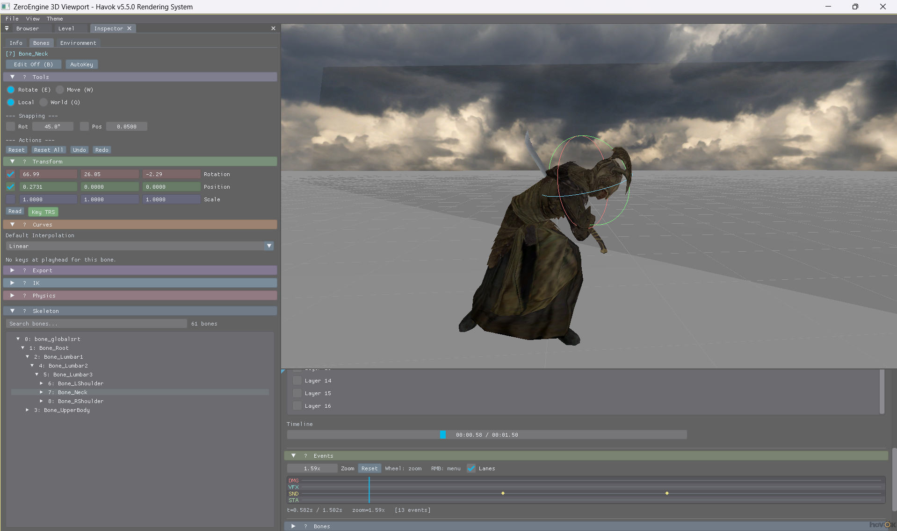

# Vespucci Engine v3  LOTR: Conquest Reverse Engineering Toolkit

A reverse-engineered, engine-level tooling suite for **The Lord of the Rings: Conquest** (Pandemic Studios, 2009). Built over years of binary analysis, Ghidra sessions, hex-stares, and enough caffeine to legally constitute a controlled substance.

This toolkit lets you structurally inspect, edit, and debug every game system  3D scene rendering, full level loading, animation pipelines, skeletal editing, collision building, particle effects, audio debugging, **a real-time entity wiring intelligence layer**, **runtime crowd modding**, **atlas baking**, crash diagnostics, and a biologically-accurate neural network visualization platform that has absolutely no business being here but exists anyway.

Pandemic Studios called their project **"Magellan"** internally. We call ours **Vespucci** because Vespucci mapped what Magellan discovered.

> **See [Important.md](Important.md) for setup instructions, known issues, and the `ConquestLLC.exe` requirement.**

---

## What's New in v3

v2 was a viewer with an Event Graph bolted on. v3 is an authoring shell.

### New systems

- **Smart Wiring** (Still in work but exists in the binary) a 213-file intelligence layer that knows the schema of every entity in the game and can rank, suggest, repair, and apply wire connections. Schema parser, custom compatibility DSL with full lexer/parser/sema/IR/codegen/VM, four spatial indexes (Grid / KD-tree / R-tree / BVH), five ranker strategies, four autocomplete backends (Trie / Marisa / Cedar / SortedVec), heal planner, undo/preview/batch apply, plus 9 dockable UI panels for inspecting every layer of it.
- **XSI Authoring Shell**  outliner, layer system, F4 wire overlay, spline handle editor, improved gizmos, type-aware property panel (driven by Smart Wiring's schema). The viewport finally edits things instead of just watching them.
- **Hero → Crowd (CRD) Converter**  `crd_builder.py` converts hero models into crowd character data. Body works. Fingers are still cursed.
- **Atlas Bake Pipeline**  Pillow paints the lighting onto the atlas, `texconv.exe` lays down DXT1 with mipmaps, header splice keeps `lotrc_rs` from mangling the result. The only known way to lift crowd visual quality without a shader cache patch.
- **Adjust Baked Weapon panel**  bone-weight selection for any skinned CRD; commits via the level patcher.
- **Standalone `corpus_builder.exe`**  offline tool that walks every `.pak` in a directory and emits a global corpus blob the editor loads as a cold-start prior for the suggestion ranker.

### What's fixed

| Bug | Where it hit | Fix |
|---|---|---|
| Duplicate-entity AV at `0x0040B605` | Copied Block1 verbatim, dangling CRC/STRING/CRCLIST/STRINGLIST entries pointed at nothing | Sanitizer added in both duplicate paths (~5550, ~5717) that zeroes any unresolvable CRC/STRING reference |
| `lotrc_rs` panic at `types.rs:506:63` | "0x<hex>_<suffix>" strings during duplicate-naming | Engine-side fix at `imgui_glue_dll.cpp` strips `0x` prefix before naming |
| Create-entity invisible in viewport | New entity appeared in panel but ghosted in 3D | EXE-side `g_go*` cache rebuild on entity create |
| renderMesh "shadowy layer" | Havok's built-in lighting painted a dim shadow pass over everything | Force CPU Lambert + `setLightingState(false)`. Six debug rounds chased this. Don't revisit. |
| BlendWeight rigid rigging | Primary weight is BYTE 2, not BYTE 0  byte 0 was being silently ignored | Confirmed via skin reverse and corrected in CRD pipeline |
| Authoritative bind drift | `_cascade_bone_world` differs from `inverse(skin_binds[idx])` by ~10°/22cm | Use the inverse-of-skin-binds form for bones in `skin_order` |
| BIN model + texture collision | Same `AssetHandle` key could resolve to either, silent corruption | Split `m_binAssets` (models) from `m_binTextureAssets`; route via `GetBinAssetData` vs `GetBinTextureData` |
| Wall destructibles refusing to die | `logic_relay` was wired with `.Activate` (no-op for this type) | Switch to `.Trigger`; documented per-mode entity twins + `DeleteOnHealthZero` / `DeathDeleteCreatesCorpse` rules |
| Havok orphan collision crash | `HkShapeInfo` entries that skipped the `ShapeInfo` chain | Must thread through the chain; lone entries crash on physics step |
| Crowd visual quality cap | In-game shader hardcodes to `tex0`; mat/asset_type edits don't reach it | Workaround: pre-light the atlas before bake (see Atlas Bake Pipeline) |

### What's reorganized

- All Scene3D source moved out of root into domain folders under `Vespucci/`: `Engine/`, `Animation/`, `Effects/`, `Level/`, `Mocap/`, `Collab/`, `Tools/`, `Neural/`, `Glue/`, `Vendor/`. Python tools moved to `Vespucci/Tools/Python/`. `build_imgui_dll.bat` and `rebuild_all.bat` updated.
- The Electron migration attempted between phases is **reverted**. Scene3D is ImGui again. The web stack (`vespucci-ui`, 36 panels + partial CEF host) is archived at `Scene3DElectron/` for reference. Don't boot it expecting it to work.

---

## Screenshots

### Level Viewer


### Model Viewer


### Animation


### Event Graph


### Galaxy View


### Neural View


### Cosmic Graph


### Flow Graph


### Explorer Graph


### Lua Scripts Graph


### Events on Map


### Collision Wireframes
.png)

---

## Quick Start

1. You need a retail copy of **The Lord of the Rings: Conquest**
2. Get the patched **`ConquestLLC.exe`** from the [Discord](https://discord.gg/rEh5Tfz6JD)  the original exe will NOT load mods
3. Extract `dev.rar` into your game executable directory
4. **Disable Windows Defender**  it flags the injector and proxy DLLs as false positives (they are not malware)
5. **First-time only: dump the levels you want to edit.** The release ships with `GameFiles/lotrcparser/lotrc_rs.exe` + `conquest_strings.txt` + the shader trees, but **NO level dumps**. Without dumps the editor boots fine but cannot open any level. See [GameFiles Layout → How to populate it](#how-to-populate-it) below for the exact `lotrc_rs.exe -d` command — one run per level (BlackGates, HelmsDeep, MinasTirith, Mordor, Pelennor, etc.). Each dump produces a `lotrcparser/<LevelName>/` subtree.
6. Launch `Conquest3DViewport.exe` from the `Scene3D` folder
7. It auto-scans `../GameFiles/` for models, animations, textures, and effects
8. **Do NOT resize the window after the program finishes initializing**  resizing causes a crash. Force fullscreen while the program is still loading.

### Required DLLs (must be next to the EXE)

| DLL | Purpose |
|---|---|
| `imgui_d3d9.dll` | ImGui docking UI + entire Smart Wiring intelligence layer (compiled with VS2022 from `Vespucci/`) |
| `cg.dll` / `cgGL.dll` | Cg shader runtime (from Havok SDK) |
| `dppDx.dll` | DirectX processing (from Havok SDK) |
| `d3dx9_29.dll` | DirectX 9 helper functions |
| `Crowd.dll` (optional) | 3dCrowd proxy v7  drop next to the game EXE for crowd modding |

### Navigation Modes

The 3D viewport supports 3 camera control styles (switchable in Settings):

| Mode | Orbit | Pan | Zoom |
|---|---|---|---|
| **Maya** (default) | Alt+LMB | Alt+MMB | Alt+RMB / Wheel |
| **Blender** | MMB | Shift+MMB | Wheel |
| **Unreal** | RMB | MMB | Wheel |

---

## GameFiles Layout — what must sit next to Scene3D

The EXE expects a sibling `GameFiles/` directory (i.e. `<install>/GameFiles/`, the same level as `<install>/Scene3D/`). It is **NOT optional**. Without the right subfolders the editor will boot but the level loader, animation system, Lua graph evaluator, CRC name resolver, particle shaders, and Save Pak pipeline all fall on their face. None of this content is shipped with the toolkit — it has to come from your own dumped copy of the game.

Required layout:

```text
GameFiles/
├── animations/                                # Native Conquest animation JSONs
│   ├── RH6_*.json                             # Crowd-rank animations (one per clip)
│   ├── graph_*.json                           # Lua-scripted animation graphs
│   └── graph_auto_*.json                      # Auto-generated graphs (RecordMo output)
├── effects/                                   # Particle / FX specs
│   └── *.json                                 # One file per effect (loaded by name)
├── textures/                                  # Raw DDS dumps
│   └── *.dds                                  # ~5696 files in a full install. Naming
│                                              # convention: 0x{LotrHashString}_{ORIG}.dds
├── srclua/                                    # Lua animation source files
│   └── *.lua                                  # AT_*, RecordMo_*, animation state Lua
└── lotrcparser/                               # ★ The Rust-parser ecosystem (Pandemic's
                                               # internal name for their PAK packer,
                                               # rediscovered as a string in the EXE)
    ├── lotrc_rs.exe                           # Rust PAK/BIN parser (from haighcam)
    ├── Shaders_PC_nvidia.bin                  # Packed shader cache (NVIDIA preferred)
    ├── Shaders_PC_ati.bin                     # Packed shader cache (AMD/ATI preferred)
    ├── Shaders_PC_generic.bin                 # Vendor-neutral fallback shader cache
    ├── Shaders_PC_nvidia/                     # Unpacked .vso / .pso tree (for particle
    │   ├── vertex_shaders/Mg_VP_*.vso         # shader hot-load and per-effect lookup)
    │   └── fragment_shaders/Mg_FP_*.pso
    ├── Shaders_PC_ati/                        # Same layout for AMD
    ├── Shaders_PC_generic/                    # Same layout for fallback
    ├── CoreScripts/
    │   └── lotrc-rust/lotrc/res/conquest_strings.txt
    │                                          # ★★ CRITICAL. The CRC → human-name
    │                                          # reverse table. Without this, every
    │                                          # entity, event, action shows as raw
    │                                          # 0x-hex hashes.
    ├── Unluac/Output/                         # Decompiled engine Lua (animation logic
    │   └── *.lua                              # graph functions, state translators)
    ├── BlackGates/                            # ★ One directory per dumped level. Each
    ├── HelmsDeep/                             # holds the full `lotrc_rs -d` output.
    ├── MinasTirith/                           # The editor cross-references these for
    ├── Mordor/                                # type imports when the Kit Wizard needs
    ├── Pelennor/                              # an entity type the current level
    ├── ...                                    # doesn't define.
    └── <YourLevel>/
        ├── pak_header.json
        ├── sub_blocks1/                       # Per-mode entity data + Lua
        │   ├── level.json                     # ★ The big one — every entity, every
        │   │                                  # field, every wire, every layer
        │   ├── AT_FLY_Eagle.lua
        │   └── *.lua                          # Other level-scoped Lua
        └── sub_blocks2/                       # Crowd data + secondary Lua
            └── 3dcrowd.json                   # Crowd instance block (edited via the
                                               # Crowd Editor panel, written back by
                                               # level_patcher.py at save time)
```

### Required vs optional

| Path | If missing |
|---|---|
| `GameFiles/lotrcparser/lotrc_rs.exe` | Save Pak, Save Collision, and Save-with-Crowd all fail. Read-only viewer still works. |
| `GameFiles/lotrcparser/CoreScripts/lotrc-rust/lotrc/res/conquest_strings.txt` | Every entity/event name displays as `0x{HEX}` — Event Graph becomes mostly unreadable |
| `GameFiles/lotrcparser/Shaders_PC_*.bin` (at least one) | No game-shader rendering at all — particles, materials, water, etc. fall back to flat colors |
| `GameFiles/lotrcparser/<LevelName>/` for the level you're loading | That level cannot load. |
| `GameFiles/animations/` | Asset Browser anim list empty; no animation playback |
| `GameFiles/effects/` | Effect preview empty; no FX in viewport |
| `GameFiles/textures/` | Models render untextured (flat-shaded) |
| `GameFiles/srclua/` | Lua-driven animation graphs degrade to clip-only playback |
| `GameFiles/lotrcparser/Unluac/Output/` | Same — Lua module loader can't find shared scripts |

### How to populate it

> **This is a mandatory first-time setup step.** The release ships with the toolchain (`lotrc_rs.exe`, `conquest_strings.txt`, shader trees, decompiled Lua) but ships **NO level dumps**. Until you run the commands below, the editor cannot open any level — pressing "Load Level" finds nothing because `GameFiles/lotrcparser/<LevelName>/` does not exist yet.

The release already places `lotrc_rs.exe` at `GameFiles/lotrcparser/lotrc_rs.exe`. Run it once per level you want to edit:

```cmd
:: From the install root:
cd GameFiles\lotrcparser

:: Dump each level you want to edit (one command per level).
:: Replace <game-install> with the path to your retail Conquest installation.
lotrc_rs.exe "<game-install>\GameData\BlackGates.PAK"   -o .
lotrc_rs.exe "<game-install>\GameData\HelmsDeep.PAK"    -o .
lotrc_rs.exe "<game-install>\GameData\MinasTirith.PAK"  -o .
lotrc_rs.exe "<game-install>\GameData\Mordor.PAK"       -o .
lotrc_rs.exe "<game-install>\GameData\Pelennor.PAK"     -o .
lotrc_rs.exe "<game-install>\GameData\Rivendell.PAK"    -o .
lotrc_rs.exe "<game-install>\GameData\Shire.PAK"        -o .
lotrc_rs.exe "<game-install>\GameData\Weathertop.PAK"   -o .
lotrc_rs.exe "<game-install>\GameData\Isengard.PAK"     -o .
lotrc_rs.exe "<game-install>\GameData\OsgiliathDay.PAK" -o .
lotrc_rs.exe "<game-install>\GameData\OsgiliathNight.PAK" -o .
lotrc_rs.exe "<game-install>\GameData\MinasMorgul.PAK"  -o .
:: ... add any other levels you need (DLC maps, multiplayer maps, etc.)
```

Each command produces a `lotrcparser/<LevelName>/` subtree containing `pak_header.json`, `sub_blocks1/`, `sub_blocks2/`, and everything else the editor needs to load that level. Dumps are typically 50–300 MB per level — pre-extracting all of them is a one-time cost.

`conquest_strings.txt`, the `Unluac/Output/*.lua` decompiled engine scripts, and the unpacked `Shaders_PC_*/` trees are bundled with this release. You only need to run the `lotrc_rs.exe -d` pass for the level dumps.

### Alternate locations

For backwards compatibility with older dev setups, two paths are searched in fallback order:

- `Shaders_PC_*.bin` is also searched in `Scene3D/`, `RE/`, `../RE/`, and `../Scene3D/` (5 prefixes total)
- `conquest_strings.txt` is also searched at `../GameFiles/lotrc/lotrc-0.6.0/lotrc-0.6.0/lotrc/res/conquest_strings.txt`
- `lotrc_rs.exe` is also searched at `tools/`, `../tools/`, `../`, and next to the EXE

You can also override the engine root via the `VESPUCCI_ENGINE_ROOT` environment variable if your install layout is non-standard.

---

## Features

### 3D Scene Viewer

- Real-time **Direct3D9 renderer** loading native Conquest engine data
- Meshes, skeletal rigs, animation channels, materials, particles, skyboxes
- **Orbit/pan/zoom camera** + first-person fly-through mode for level exploration
- **Bone editor** with rotation/translation gizmos, undo/redo, pose library, keyframe recording
- Animation playback with **multi-layer blending**, **Lua-scripted animation graphs**, and **motion matching**
- **Particle system preview** using Pandemic's actual compiled D3D9 shaders from the retail disc
- **Material inspector** with DDS texture preview, gamma control, anisotropic filtering, mip bias
- **Asset browser** for batch loading 50,000+ game assets with search and filtering
- Full **ImGui docking UI** via `imgui_d3d9.dll`  every panel is dockable, resizable, and tabbed

### Level Editor / XSI Authoring Shell

- Load **entire Conquest levels** directly from PAK/BIN files  thousands of mesh instances at 60fps
- **Level Inspector**  click any object to see its type, fields, transforms, events, game mode mask
- **Outliner**  full scene hierarchy with multi-select, range select, focus, isolate
- **Layer system**  toggle, lock, solo, GMM-gated layer visibility
- **F4 wire overlay**  toggle event-graph wires drawn over the 3D viewport
- **Type-aware properties panel**  driven by the Smart Wiring schema; shows every field on the entity with the correct widget per type
- **Spline handle editor**  direct manipulation of spline curves in 3D
- **Event Graph**  visual node editor for Pandemic's entity event system with 4 zoom scales:
  - **Constellation**  layer clusters as star systems
  - **Galaxy**  entities as orbiting planets around folder-stars
  - **Neural**  event connections as a biologically-modeled neural network with Hodgkin-Huxley dynamics
  - **Cosmic**  individual entity relationships with supernova transitions
- **Entity creation** wizard with full type definition support and visibility cache rebuild
- **Object positioning** with 3D translate/rotate gizmos
- **Duplicate entity** with automatic dangling-CRC sanitizer (no more AVs at `0x0040B605`)
- **Collision mesh building**  generate meshes from model geometry, build MOPP BVTrees via Havok 5.5
- **Save modified levels** through Rust parser pipeline (automatic dump + recompile sanitization)
- **Game mode filtering**  view which entities belong to which game modes (Campaign, Conquest, Hero modes)

### Smart Wiring Intelligence Layer (new in v3)

The Smart Wiring layer treats your level file like source code and your editor like an IDE. It knows the type signature of every event, action, and field in the game.

- **Schema parser** (`Vespucci/Schema/`)  every entity type, every event signature, loaded from the Lua signature database
- **Compatibility DSL** (`Vespucci/Compat/DSL/`)  write rules in a tiny custom language with full lexer / parser / semantic analyzer / IR lowering / codegen / VM / stdlib. Hot-reloadable via the Compatibility Editor panel.
- **Spatial indexes** (`Vespucci/Index/`)  Grid, KD-tree, R-tree, BVH; benchmarked against each other in the Index Benchmark panel
- **Suggest pipeline** (`Vespucci/Suggest/`)  candidate generation → confidence gate → reason builder → ranker. Five ranker strategies: Frequency, TypeDirected, Hybrid, MLStub, RankerSelector.
- **Autocomplete backends** (`Vespucci/Autocomplete/`)  Trie, Marisa, Cedar, SortedVec, fuzzy match. Switchable at runtime.
- **Repair / health scoring** (`Vespucci/Repair/`)  broken-ref scanner, did-you-mean, heal planner, health rules, score breakdown
- **Apply pipeline** (`Vespucci/Apply/`)  preview-before-commit, undo stack, batch ops, placement policy
- **Telemetry + Replay QA**  perf scope, counters, dashboard, hot-path profiler, golden corpus regression tests, replay recorder/player
- **Plugin loader**  drop in your own rankers / indexes / repair strategies
- **Localization**  en + tr string tables, plural rules, RTL support
- **9 dockable UI panels**  Suggested Wires, Health Fix, Compatibility Editor, Corpus Browser, Schema Diff, Replay Viewer, Golden Runner, Debug Ranker overlay, Ghost Target overlay
- **`corpus_builder.exe`**  standalone offline tool that bakes a global corpus prior from every PAK in a directory

### Animation System (Still Experimental)

- **11,726 animations** decoded from 6 different compression schemes (ThreeComp40, ThreeComp48, ThreeComp24, Polar32, Straight16, Uncompressed)
- **Lua animation state machine**  rebuilt Pandemic's scripted animation system: states, transitions, conditions, blend trees, parametric blending
- **AnimTable & filter evaluation**  stance/action filtering for clip resolution
- **Motion matching**  data-driven animation selection based on velocity and facing direction
- **Root motion**  full/clampY/off/extract modes with axis locking and warp targeting
- **IK system**  FABRIK solver with foot placement, look-at, aim-at, and custom chain support
- **Physical animation / ragdoll**  spring-damper bone simulation with impulse response
- **Timeline editor**  keyframe editing with 29 easing types, custom Bezier curves, animation events (sound, damage, particle, camera, state, projectile, throw, bow, controller, grab, charge)
- **Compression tools**  analyze and optimize keyframe data with configurable tolerances
- **Export**  save custom animations as JSON clips

### 3dCrowd Runtime Modding (new in v3)

- **Class-agnostic animation discovery**  any `RH6_*` clip plays on any human-rank CRD; only giant and hobbit ranks are gated
- **Atlas bake pipeline**  `Pillow` paints lighting + masks onto the atlas, `texconv.exe` writes DXT1 with mipmaps, header splice keeps `lotrc_rs` from mangling the output. The only way to lift crowd visual quality without a shader cache patch.
- **`crd_builder.py`**  converts hero models into crowd CRD files. Body works on Haldir + other tested heroes; fingers still glitch.
- **Adjust Baked Weapon panel**  pick bones by weight on any skinned CRD; apply persists by `(model, bone)` keys; save commits via `level_patcher.apply_embedded_weapon_xforms`.

### Mocap from Webcam (Experimental DOES NOT WORK PROPERLY)

- **WHAM-based motion capture**  spawns Python subprocess running real-time pose estimation
- **24 SMPL joints → 62 game bones** retargeting with coordinate system conversion
- **Savitzky-Golay smoothing** and procedural finger curl
- **Export to native Conquest animation format** (ThreeComp40 packed quaternions)
- ImGui control panel with webcam preview, recording controls, bone map visualization

### Neural Network Visualizer

- **Biologically accurate** 3D neural rendering  not circles-and-lines, actual neuroscience
- **Membrane wobble** from voltage-dependent displacement (Zhang et al., 2001)
- **Voltage-to-color** ramp matching calcium imaging conventions (-70mV → +40mV)
- **Hebbian plasticity glow** representing Long-Term Potentiation (Hebb, 1949)
- **Subsurface scattering** approximation for translucent neural tissue
- **6 render passes**: geometry → depth → SSAO → bloom → blur → fog composite
- **Fresnel rim** glow from membrane refractive index mismatch (n≈1.46 vs n≈1.33)
- Runs on a **separate OpenGL 3.3 thread** alongside the D3D9 game renderer
- Full scientific breakdown with citations in `Vespucci/Neural/neural_gl_renderer.h`

### Crash Preventer

Drop-in stability layer for the original game:

| File | Role |
|---|---|
| `version.dll` | Auto-loads debugger at game launch |
| `ConquestDebugger.dll` | Crash handler, minidump writer, memory/thread monitor |
| `d3d9.dll` (16 KB) | Lightweight D3D9 proxy for render-path stability |

Copy all three into the game's root directory. No configuration needed.

### Audio Debugger

Runtime audio inspection overlay:

| File | Role |
|---|---|
| `d3d9.dll` (50 KB) | D3D9 proxy with debug hooks |
| `DebugOverlay.dll` | In-game BNK browser, audio event viewer, custom playback |
| `Injector.exe` | Injects overlay into running game process |

Launch the game first, then run `Injector.exe`.

---

## Architecture

```
ZeroEngine/
├── Scene3D/                        # Main engine  ~50,000 lines
│   ├── Vespucci/                   # Everything that isn't ImGui itself
│   │   ├── Engine/                 # Renderer, camera, skybox, material, shaders, Havok bridge
│   │   ├── Animation/              # Anim system, Lua state machine, motion matching, IK, curves
│   │   ├── Effects/                # Particle effect system
│   │   ├── Level/                  # PAK/BIN reader, level inspector/validator/templates, asset browser
│   │   ├── Mocap/                  # WHAM bridge, retargeter, exporter
│   │   ├── Collab/                 # GameBridgeClient, CollabSession
│   │   ├── Tools/                  # Editor tools + offline CLI mains + Python/
│   │   │   └── Python/             # level_patcher, crd_builder, crowd_proxy_test, etc.
│   │   ├── Neural/                 # Neural network visualizer
│   │   ├── Glue/                   # imgui_glue_dll.cpp, imgui_mocap_panel.cpp
│   │   ├── Vendor/                 # miniz, VC8-era stdint shim (DO NOT put on modern /I path)
│   │   │
│   │   ├── Core/                   # Smart Wiring: hash, arena, ring buffer, file IO, logging
│   │   ├── Schema/                 # ZE type registry + event/action signature DB
│   │   ├── Compat/                 # Compatibility matrix + custom DSL (lexer/parser/IR/codegen/VM)
│   │   ├── Scene/                  # Scene snapshot, entity index, wire graph index, layer index
│   │   ├── Index/                  # Grid / KD-tree / R-tree / BVH spatial indexes
│   │   ├── Corpus/                 # Local + global corpus builders, reader, writer, merger, decay
│   │   ├── Suggest/                # Candidate gen, confidence gate, reason builder, 5 ranker strategies
│   │   ├── Autocomplete/           # Trie / Marisa / Cedar / SortedVec / fuzzy match
│   │   ├── Repair/                 # Broken-ref scanner, did-you-mean, heal planner, health scorer
│   │   ├── Apply/                  # Preview, undo, batch ops, placement policy
│   │   ├── UI/                     # 9 dockable Smart Wiring panels
│   │   ├── Telemetry/              # Perf scope, counters, sinks, dashboard, hot-path profiler
│   │   ├── Plugin/                 # Plugin registry + loader
│   │   ├── Localization/           # String table, plural rules, en/tr lang packs, RTL
│   │   ├── Docs/                   # Header scraper, markdown emitter, DSL reference emitter
│   │   └── QA/                     # Replay recorder/player, golden corpus tests, regression runner
│   ├── RE/                         # 35 reverse-engineered Magellan engine headers (Mg*)
│   ├── imgui/                      # Dear ImGui (docking branch)
│   ├── build_imgui_dll.bat         # VS2022 build for the DLL
│   ├── build_corpus_builder.bat    # VS2022 build for corpus_builder.exe
│   └── rebuild_all.bat             # VS2005 build for the engine EXE
├── Engine/
│   ├── DLL/                        # Runtime DLLs (D3D9 proxy, debugger, audio overlay, Crowd v7)
│   │   ├── ConquestDebugger/
│   │   ├── D3D9Proxy/
│   │   ├── CrowdProxy/             # Crowd.dll v7
│   │   └── ConquestConsole-main/
│   ├── source/                     # Havok 5.5.0 SDK (not redistributed)
│   └── lib/                        # DirectX SDK (not redistributed)
├── Scene3DElectron/                # Archived: v2.x→v3 Electron migration, reverted to ImGui
├── CoreScripts/                    # lotrc Rust parser (haighcam, MIT license)
├── GameFiles/                      # Extracted game assets (not redistributed)
└── tools/                          # lotrc_rs.exe, build scripts
```

### Split Compiler Architecture

| Component | Compiler | Standard | Why |
|---|---|---|---|
| Main engine EXE + Havok | VS2005 | C++03 | Havok 5.5 .lib files require VS2005 ABI |
| ImGui DLL + Smart Wiring | VS2022 | C++17 | ImGui + Smart Wiring need modern C++ |
| `corpus_builder.exe` | VS2022 | C++17 | Standalone offline tool, no engine link |
| Communication | Pure C ABI | `extern "C"` | Only safe way to cross compiler versions |

> **Trap:** the `Vespucci/Vendor/stdint.h` shim exists for VC8 (which lacks `<stdint.h>` for `miniz.c`). It MUST NOT be on the modern-MSVC `/I` path or `<cstdint>` blows up. `build_imgui_dll.bat` deliberately excludes `Vespucci/Vendor` from its `VINC` aggregate. `rebuild_all.bat` is the only build that includes it.

---

## Save Pipeline

### Level Save (Save PAK)

1. C++ `SavePak()` writes modified PAK with duplicate-entity sanitizer applied (zeroes any dangling CRC/STRING/CRCLIST/STRINGLIST references)
2. `lotrc_rs.exe -d` dumps to editable format (sanitize pass; `0x`-prefix strings already stripped engine-side)
3. `lotrc_rs.exe -c` recompiles from scratch
4. Clean PAK/BIN copied back

### Collision Save (Save to PAK in Model Viewer)

1. Collision mesh + MOPP exported to `collision_export.json`
2. `collision_repack.py` subprocess: dump PAK → patch model shapes → recompile
3. Or manually: `python Vespucci/Tools/Python/collision_repack.py "<pak>" "collision_export.json" "<model_name>" "<lotrc_rs_path>"`

### Crowd Atlas Bake

1. Read source CRD atlas + bone weights
2. Pillow paints lighting / masks onto the strip
3. `texconv.exe` writes DXT1 with mipmaps
4. Header splice keeps `lotrc_rs` from mangling the result
5. Embed back into PAK

Both pipelines require `lotrc_rs.exe`. Collision and crowd also require Python 3.x.

---

## Building from Source

> **You do NOT need to build from source to use the toolkit.** Pre-built binaries are available in [Releases](../../releases). This section is only for developers who want to compile the engine themselves.

### Required SDKs (not redistributable)

The following SDKs are **required to compile** but cannot be legally redistributed. They are no longer available from their original sources  join the **[Discord](https://discord.gg/rEh5Tfz6JD)** to get setup guidance and access to these files:

| Dependency | Notes |
|---|---|
| **Havok 5.5.0 SDK** | Physics + animation + graphics bridge. Microsoft acquired Havok and buried all old versions. Available on Discord. |
| **DirectX SDK (March 2008)** | D3D9 headers and libs. Microsoft no longer hosts the 2008 version. Available on Discord. |
| **Wwise SDK** | Audio middleware headers. Free tier exists from Audiokinetic but the specific version we need is old. Available on Discord. |
| **Visual Studio 2005** | Required for main engine compilation (Havok ABI). Microsoft no longer distributes VS2005. Available on Discord. |
| **Visual Studio 2022 BuildTools** | Required for ImGui DLL + Smart Wiring + `corpus_builder.exe`. Free Community Edition from Microsoft. |
| **Python 3.x** | Required for collision pipeline, mocap, and crowd atlas baking. Free from python.org. |
| **lotrc_rs.exe** | Rust PAK/BIN parser. Available on Discord and Haighcam's repository. |

> **Why Discord?** These are 2008-era proprietary SDKs that no longer exist on official download servers. Distributing them on GitHub would violate their licenses. The Discord server provides them for preservation and modding research purposes only.

### Build commands

From `Scene3D/`:

```cmd
rebuild_all.bat           :: VS2005 build → Conquest3DViewport.exe
build_imgui_dll.bat       :: VS2022 build → imgui_d3d9.dll
build_corpus_builder.bat  :: VS2022 build → corpus_builder.exe
```

Override the SDK paths if your install is non-standard:

```cmd
set HAVOK_SDK_DIR=D:\Havok\hk550
set WWISE_SDK_DIR=D:\Wwise\SDK
rebuild_all.bat
```

### About `vc80.pdb` (first-build note)

`vc80.pdb` is the shared program database VS2005's `cl.exe` writes type info into across every translation unit in the engine. It is **not shipped** with the release — `cl.exe` creates it from scratch on your first `rebuild_all.bat` run. Expect that first build to be noticeably slower than subsequent ones; the compiler is populating the PDB. Once it exists, leave it alone:

- **Never delete `vc80.pdb` or `vc80.idb` while a build is in progress.** Deleting it mid-build corrupts the `.obj` files that reference its type info, and the resulting EXE either fails to link or runs into heap crashes at startup. If you want a fresh artifact state, delete every `.obj` **AND** `vc80.pdb` **AND** `vc80.idb` together, then run a full clean `rebuild_all.bat`.
- The PDB grows to ~2 MB after a full build. That's normal.
- Single-file recompiles must use `/Z7` (embedded debug info), **NOT** `/Zi` (shared PDB). The build scripts already use `/Z7` for this reason; if you write your own one-off compile command, do the same. `/Zi` against the shared PDB corrupts it for the next full build.

---

## Controls

### Camera

| Input | Action |
|---|---|
| **Alt + Left Mouse** | Orbit around target |
| **Alt + Middle Mouse** | Pan camera |
| **Alt + Right Mouse** | Dolly (zoom via drag) |
| **Mouse Wheel** | Zoom in/out |
| **F** | Focus camera on model |
| **F3** | Toggle fly camera (WASD + mouse look) |

### Fly Camera (F3)

| Input | Action |
|---|---|
| **WASD** | Move forward/back/strafe |
| **Space** | Jump (gravity on) / Ascend (gravity off) |
| **C** | Ascend |
| **G** | Toggle gravity on/off |
| **Right Mouse + Drag** | Look around |

### General

| Key | Action |
|---|---|
| **F1** | Toggle help overlay |
| **H** | Toggle info overlay (model, anim, settings) |
| **F2** | Toggle Asset Browser |
| **F4** | Toggle skybox / editor objects / wire overlay (level mode) |
| **F5** / **Ctrl+R** | Rescan GameFiles |
| **F6** | Toggle Asset Data Inspector |
| **Shift+F6** | Cycle skybox |
| **F9** | Toggle Legacy Win32 UI |
| **F10** | Cycle sky render mode |
| **F11** | Toggle dark/light theme |
| **Esc** | Cancel edit / close browser / quit |

### Animation Playback

| Key | Action |
|---|---|
| **Space** / **Insert** | Play / Pause |
| **F7** / **Page Up** | Previous animation |
| **F8** / **Page Down** | Next animation |
| **Z** / **Home** | Seek to start |
| **X** / **End** | Seek to end |
| **[** / **8** | Step back 0.25s |
| **]** / **9** | Step forward 0.25s |
| **Arrow Up/Down** | Blend walk/run (blend mode) |

### Asset Browser (F2)

| Key | Action |
|---|---|
| **Tab** | Switch Model / Animation mode |
| **Up/Down** | Navigate list |
| **Enter** | Load selection |
| **Esc** | Close browser |

### Bone Editor (B to activate)

| Key | Action |
|---|---|
| **B** | Toggle edit mode on/off |
| **W** | Switch to Move (translate) gizmo |
| **E** | Switch to Rotate gizmo |
| **Q** | Toggle Local / World space |
| **V** | Toggle snap on/off |
| **N** | Cycle snap step size |
| **I** | Toggle interpolation (Linear / Hold) |
| **Enter** / **K** | Commit edit / set keyframe |
| **Esc** | Cancel current edit |

### Axis Constraints (while dragging)

| Key | Action |
|---|---|
| **X** (hold) | Lock to X axis |
| **Y** (hold) | Lock to Y axis |
| **Z** (hold) | Lock to Z axis |
| **Ctrl** (hold) | Fine precision (0.25x speed) |
| **Shift** (hold) | Coarse/fast (2x speed) |

### Mouse Editing

| Input | Action |
|---|---|
| **Click gizmo axis/ring** | Start drag on that axis |
| **Ctrl + Left Click** | Free-axis drag (no constraint) |
| **Shift + Click (timeline)** | Add keyframe at millisecond precision |
| **Right Click (timeline)** | Context menu (add/delete events) |
| **Mouse Wheel (timeline)** | Zoom timeline |

### Level Editor

| Input | Action |
|---|---|
| **Alt + Left Click** | Pick/select entity in viewport |
| **Ctrl + Right Click** | Create entity at world position |
| **Ctrl + Click (panel)** | Multi-select entities |
| **Shift + Click (panel)** | Range select entities |
| **Ctrl + D** | Duplicate selected entity (with CRC sanitizer) |

### Camera Bookmarks & Views

| Key | Action |
|---|---|
| **Ctrl+1/2/3** | Jump to camera preset 1/2/3 |
| **Numpad 1** | Front ortho view |
| **Numpad 3** | Side ortho view |
| **Numpad 7** | Top ortho view |
| **Numpad 5** | Toggle perspective / orthographic |

### Panel Layout (Legacy UI)

| Key | Action |
|---|---|
| **Ctrl+1** | Collapse/expand left panel |
| **Ctrl+2** | Collapse/expand right panel |
| **Ctrl+3** | Collapse/expand timeline |

---

## Community

**Discord:** https://discord.gg/rEh5Tfz6JD

For setup assistance, the patched `ConquestLLC.exe`, game files, and development discussion.

---

## Credits

- **Eriumsss**  Engine reverse engineering, 3D viewer, animation system, level editor, Smart Wiring intelligence layer, XSI authoring shell, crowd proxy, atlas pipeline, neural renderer.
- **haighcam**  lotrc Rust parser (PAK/BIN format reference implementation)
- **Pandemic Studios** (RIP 2009)  Built the Magellan engine. Their code lives on in our reverse-engineered headers. They didn't know we'd be here a decade and a half later reading their binary formats at 4 AM. We didn't either.

---

## Third-Party

| Library | License |
|---|---|
| Dear ImGui | MIT |
| nlohmann/json | MIT |
| miniaudio | Public Domain / MIT-0 |
| Lua 5.1 | MIT |
| miniz | Public Domain |
| Marisa-Trie | BSD |
| Cedar (double-array trie) | BSD-2 |
| lotrc (Rust parser) | MIT |
| WHAM (mocap) | research license  bundled separately |

---

## Disclaimer

This project is **not affiliated with** Electronic Arts, Pandemic Studios, Warner Bros. Interactive Entertainment, or the Tolkien Estate.

**No game assets**  executables, audio, textures, models, or copyrighted content  are distributed in this repository.

This is an independently developed fan-made modding toolkit created through clean-room reverse engineering for interoperability, preservation, and research purposes.

Use at your own risk.

---

## License

GPLv3  Copyright (c) 2026 Eriumsss. See [LICENSE](LICENSE) for details.
